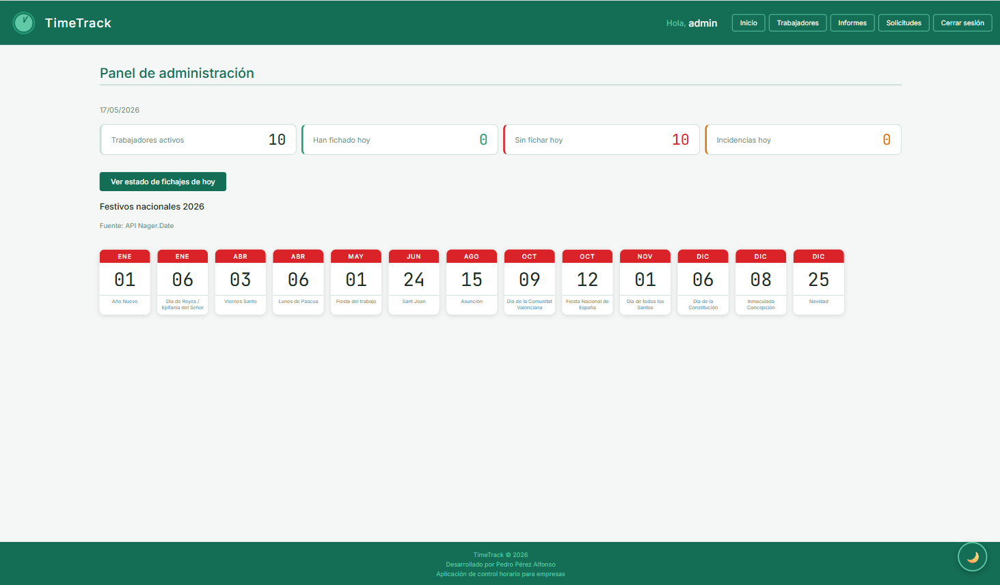
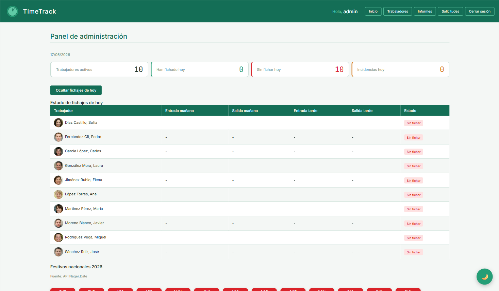
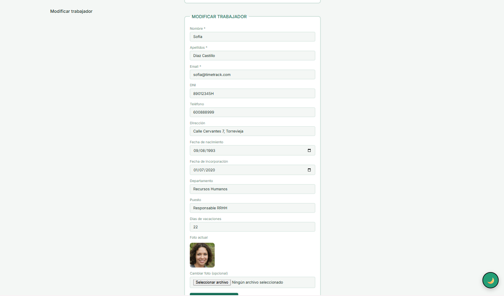
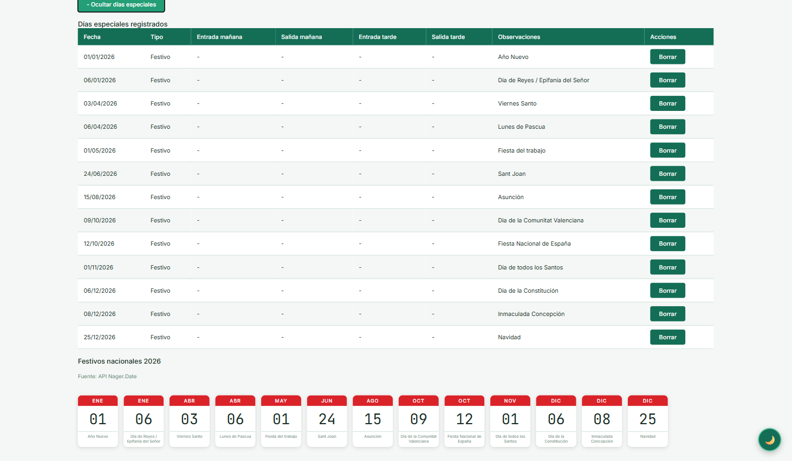
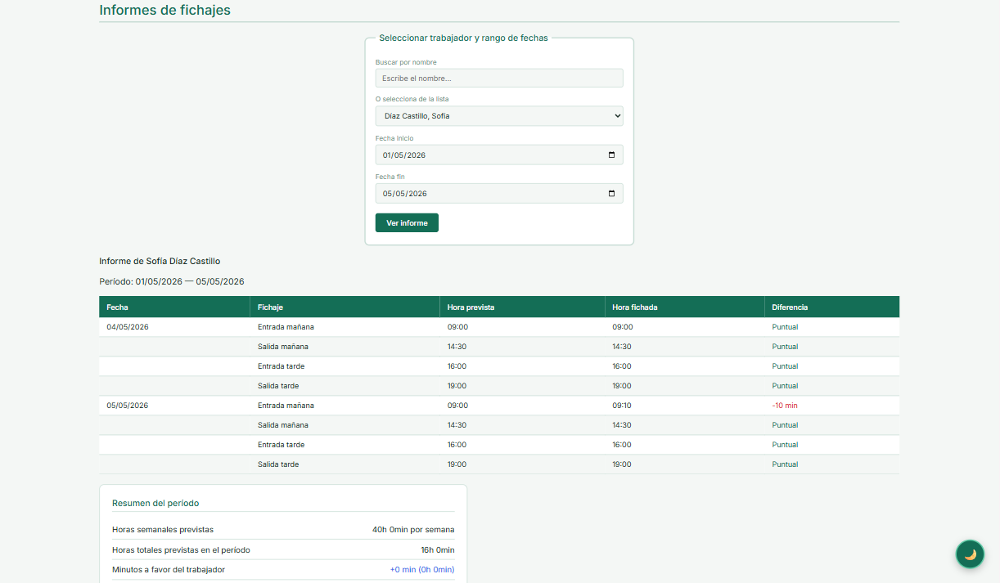
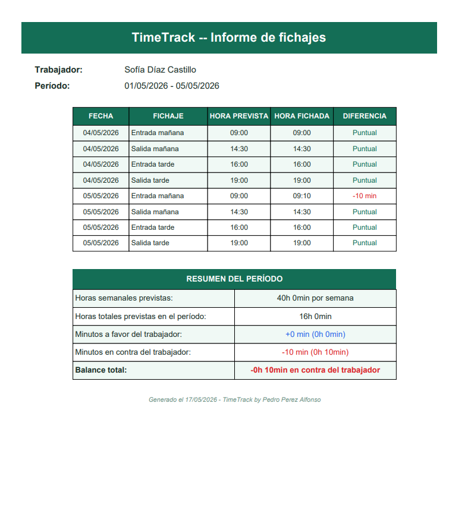

# Funcionalidades

[← Volver al índice](index.md)

---

## Panel del administrador

### Dashboard

Al entrar al panel el administrador ve cuatro indicadores en tiempo real:

- **Trabajadores activos** — total de empleados en plantilla
- **Han fichado hoy** — trabajadores con al menos un fichaje del día
- **Sin fichar hoy** — trabajadores que no han fichado ningún turno
- **Incidencias hoy** — incidencias generadas en el día actual

Al cargar el panel se ejecuta automáticamente un proceso que revisa si el día anterior hubo trabajadores con fichajes incompletos. Por cada fichaje no realizado se genera una incidencia en la base de datos.

---

### Gestión de trabajadores

Permite buscar trabajadores por nombre o seleccionarlos de una lista. El resultado se muestra en una tabla paginada de 5 registros por página con las acciones de horario, modificar y borrar.

Desde esta pantalla el administrador puede:

- **Dar de alta** un nuevo trabajador con todos sus datos y foto
- **Modificar** los datos de un trabajador existente
- **Borrar** un trabajador con confirmación

El formulario de alta valida los campos en el cliente antes de enviar los datos al servidor, usando expresiones regulares para nombre, email, DNI, teléfono y contraseña.

El formulario de modificación muestra todos los campos del trabajador y permite actualizar la foto de perfil:

---

### Horarios

Cada trabajador tiene su propio horario semanal editable de lunes a viernes con jornada partida: entrada y salida de mañana, y entrada y salida de tarde.

Además se pueden registrar **días especiales** para fechas concretas:

- **Vacaciones** — el trabajador ve el mensaje de vacaciones
- **Festivo** — el trabajador ve el mensaje de festivo
- **Día libre** — el trabajador ve el mensaje de día libre
- **Cambio de horario** — el trabajador ficha con un horario diferente al habitual

---

### Informes

El administrador puede generar informes de cualquier trabajador en un rango de fechas. El informe muestra para cada fichaje la hora prevista, la hora real y la diferencia en minutos. Al final aparece un resumen con el balance total del período.

Desde el informe se puede generar un **PDF** con la librería FPDF que incluye la cabecera de TimeTrack, la tabla de fichajes y el resumen del período:

---

## Panel del trabajador

El trabajador accede a la aplicación con su usuario y contraseña desde cualquier dispositivo. Una vez dentro ve su jornada del día actual con un reloj en tiempo real y cuatro botones de fichaje.

### Fichaje

La pantalla principal muestra la fecha, el reloj en tiempo real y los cuatro tipos de fichaje:

- **Entrada mañana**
- **Salida mañana**
- **Entrada tarde**
- **Salida tarde**

Cada botón muestra la hora prevista según el horario asignado. Al pulsar FICHAR, la acción se registra en el servidor mediante AJAX sin recargar la página, de forma que el reloj no se interrumpe. Una vez fichado, el botón muestra la hora real registrada y la diferencia en minutos respecto a la hora prevista.

Los cuatro botones están siempre disponibles e independientes entre sí. No es obligatorio seguir un orden.

### Estados especiales

La aplicación detecta automáticamente situaciones en las que el trabajador no debe fichar y muestra un mensaje en lugar de los botones:

| Situación | Mensaje mostrado |
|---|---|
| Fin de semana | Hoy es fin de semana, ¡descansa! |
| Vacaciones | Hoy estás de vacaciones |
| Festivo | Hoy es festivo |
| Día libre | Hoy tienes el día libre |
| Sin horario asignado | Contacta con el administrador |
| Jornada completada | ¡Jornada completada, hasta mañana! |

### Perfil

El trabajador puede consultar sus datos personales y laborales: nombre, email, DNI, teléfono, dirección, fecha de nacimiento, departamento, puesto y fecha de incorporación.

### Vacaciones

Muestra los días de vacaciones totales, gastados y disponibles, junto con el calendario de festivos nacionales del año en curso obtenido de la API Nager.Date.
