# Funcionalidades

[← Volver al índice](index.md)

---

## Login

La pantalla de acceso es la primera que ve cualquier usuario. Muestra el formulario de usuario y contraseña con el logotipo de TimeTrack animado, un slideshow de imágenes y la opción "Recuérdame" que guarda las credenciales en una cookie durante 30 días.

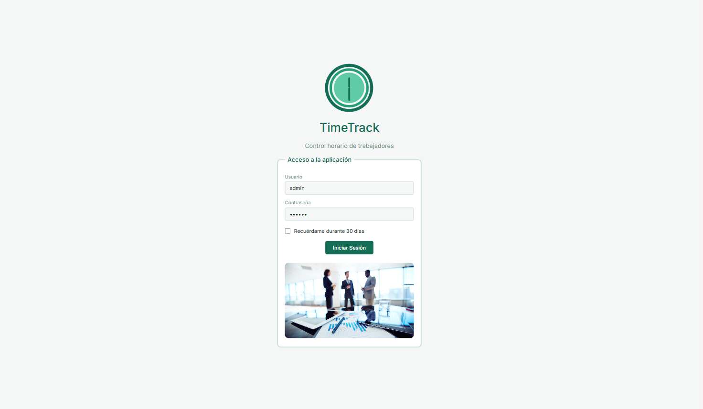

---

## Panel del administrador

### Dashboard

Al entrar al panel el administrador ve cuatro indicadores en tiempo real:

- **Trabajadores activos** — total de empleados en plantilla
- **Han fichado hoy** — trabajadores con al menos un fichaje del día
- **Sin fichar hoy** — trabajadores que no han fichado ningún turno
- **Incidencias hoy** — incidencias generadas en el día actual

Al cargar el panel se ejecuta automáticamente un proceso que revisa si el día anterior hubo trabajadores con fichajes incompletos. Por cada fichaje no realizado se genera una incidencia en la base de datos. Además, jQuery lanza una petición AJAX que importa desde la API Nager.Date los festivos nacionales y de la Comunitat Valenciana que no existan todavía en la base de datos.

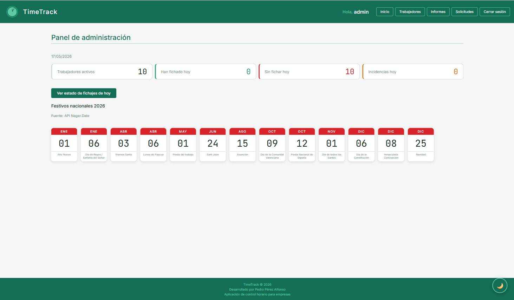

---

### Fichajes del día

Desde el panel el administrador puede desplegar con un botón la tabla de fichajes del día, que muestra el estado de cada trabajador: sin fichar, en curso o jornada completa.

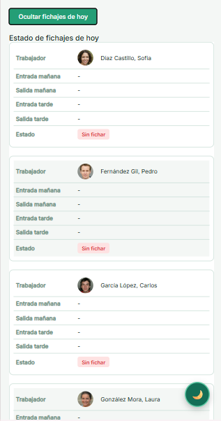

---

### Gestión de trabajadores

Permite buscar trabajadores por nombre o seleccionarlos de una lista. El resultado se muestra en una tabla paginada de 5 registros por página con las acciones de horario, modificar y borrar.

Desde esta pantalla el administrador puede:

- **Dar de alta** un nuevo trabajador con todos sus datos y foto
- **Modificar** los datos de un trabajador existente
- **Borrar** un trabajador con confirmación

El formulario de alta valida los campos en el cliente antes de enviar los datos al servidor, usando expresiones regulares para nombre, email, DNI, teléfono y contraseña. También permite aplicar el **horario estándar de empresa** (L–J 08:30–14:00 / 16:00–19:00, V 08:30–14:00 / 16:00–18:30) con un solo clic.

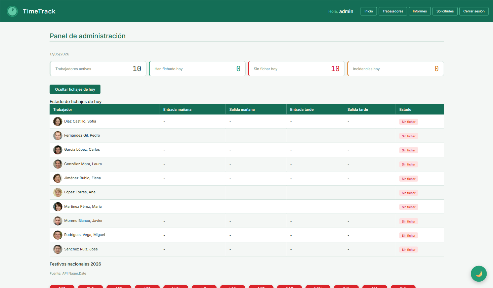

El formulario de modificación muestra todos los campos del trabajador y permite actualizar la foto de perfil:

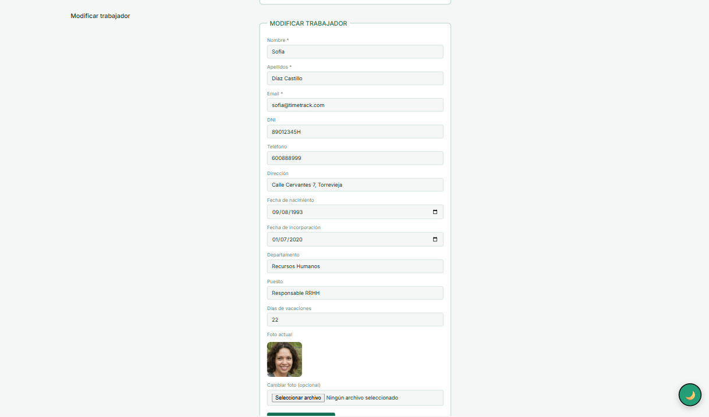

---

### Horarios

Cada trabajador tiene su propio horario semanal editable de lunes a viernes. El horario puede ser **jornada partida** (mañana y tarde) o **jornada continua** (solo mañana), dejando los campos de tarde vacíos.

Además se pueden registrar **días especiales** para fechas concretas:

- **Vacaciones** — el trabajador ve el mensaje de vacaciones
- **Festivo** — el trabajador ve el mensaje de festivo
- **Día libre** — el trabajador ve el mensaje de día libre
- **Cita médica** — el trabajador ve el mensaje de cita médica
- **Asuntos propios** — el trabajador ve el mensaje correspondiente
- **Cambio de horario** — el trabajador ficha con un horario diferente al habitual

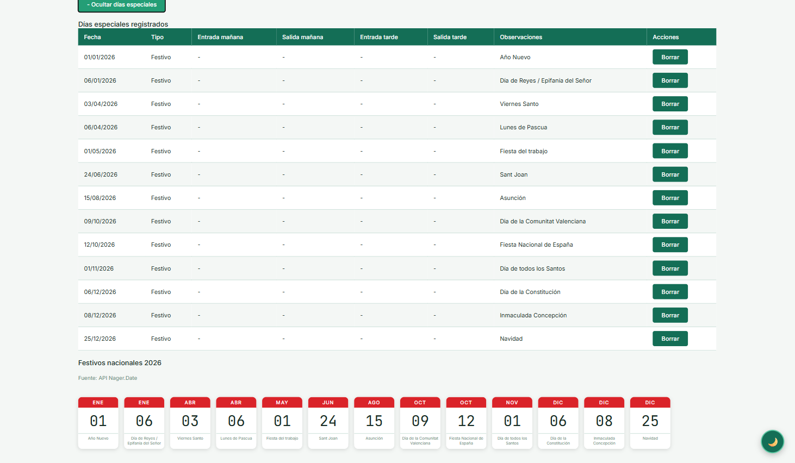

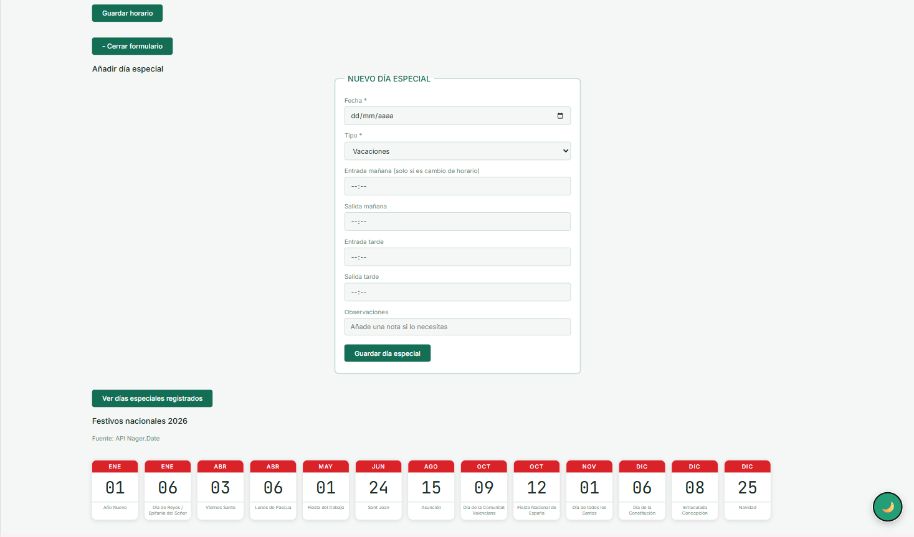

---

### Incidencias

El administrador puede consultar las incidencias de cualquier trabajador filtrando por mes, año y nombre. Las incidencias se generan automáticamente por el sistema en dos situaciones:

- **Retraso o horas extra** — cuando la diferencia entre la hora prevista y la hora fichada supera los 5 minutos
- **Fichaje no realizado** — cuando al cargar el dashboard se detecta que ayer un trabajador no completó algún fichaje

Cada incidencia muestra la fecha, el tipo con un badge de color, los minutos y las observaciones generadas automáticamente.

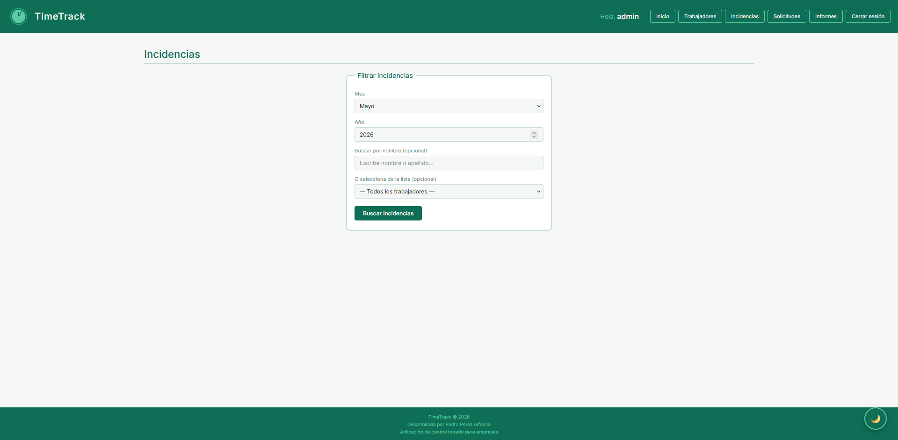

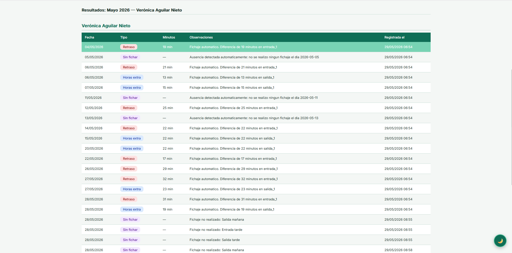

---

### Informes

El administrador puede generar informes de cualquier trabajador en un rango de fechas. El informe muestra para cada fichaje la hora prevista, la hora real y la diferencia en minutos. Al final aparece un resumen con el balance total del período:

- **Horas semanales previstas** — calculadas a partir del horario asignado
- **Horas totales previstas en el período**
- **Minutos a favor del trabajador** — llegadas antes de hora o salidas tardías
- **Minutos en contra del trabajador** — retrasos o salidas anticipadas
- **Balance total** — diferencia entre los dos anteriores

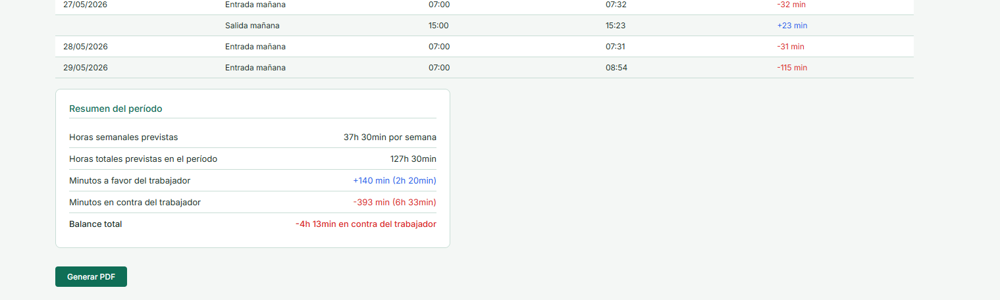

Desde el informe se puede generar un **PDF** con la librería FPDF que incluye la cabecera de TimeTrack, la tabla de fichajes y el resumen del período:

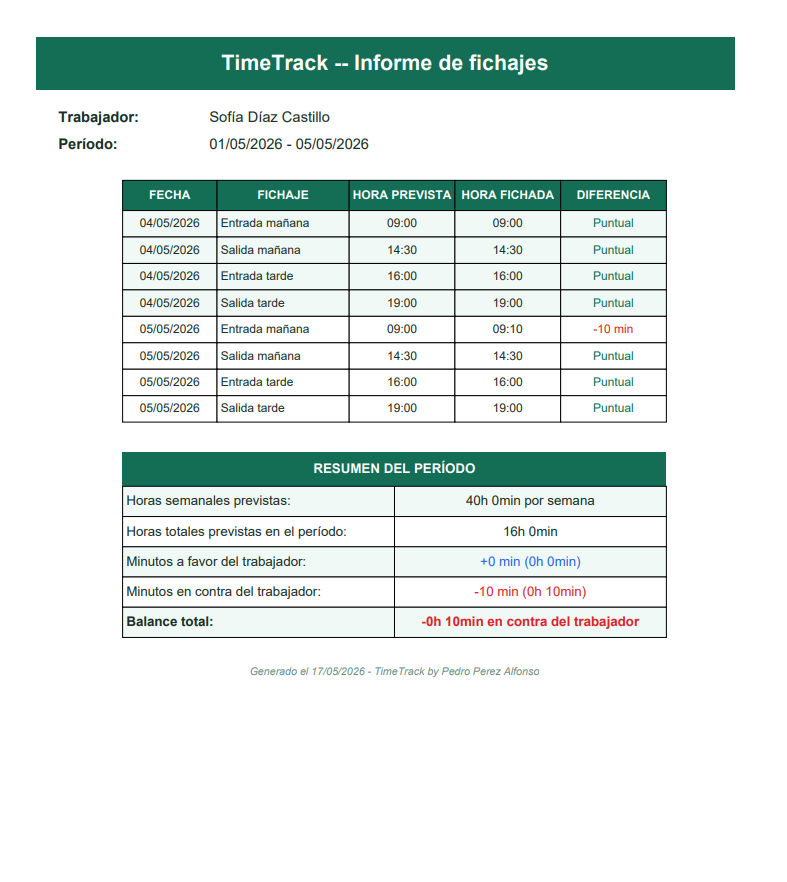

---

### Solicitudes de vacaciones

El administrador puede ver todas las solicitudes enviadas por los trabajadores, aprobarlas o denegarlas. Al aprobar una solicitud, el sistema crea automáticamente los días especiales correspondientes en el horario del trabajador y descuenta los días del contador de vacaciones disponibles. Las citas médicas no descuentan días de vacaciones.

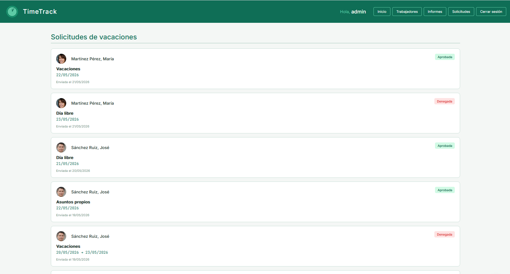

---

## Panel del trabajador

El trabajador accede a la aplicación con su usuario y contraseña desde cualquier dispositivo. Una vez dentro ve su jornada del día actual con un reloj en tiempo real y los botones de fichaje correspondientes a su tipo de jornada.

### Fichaje

La pantalla principal muestra la fecha, el reloj en tiempo real y los fichajes del día. La aplicación adapta los botones al tipo de jornada asignada:

- **Jornada partida** — muestra los cuatro fichajes: entrada mañana, salida mañana, entrada tarde y salida tarde
- **Jornada continua** — muestra solo los dos fichajes de mañana

Al pulsar FICHAR, la acción se registra en el servidor mediante AJAX sin recargar la página, de forma que el reloj no se interrumpe. Una vez fichado, el botón muestra la hora real registrada y la diferencia en minutos respecto a la hora prevista.

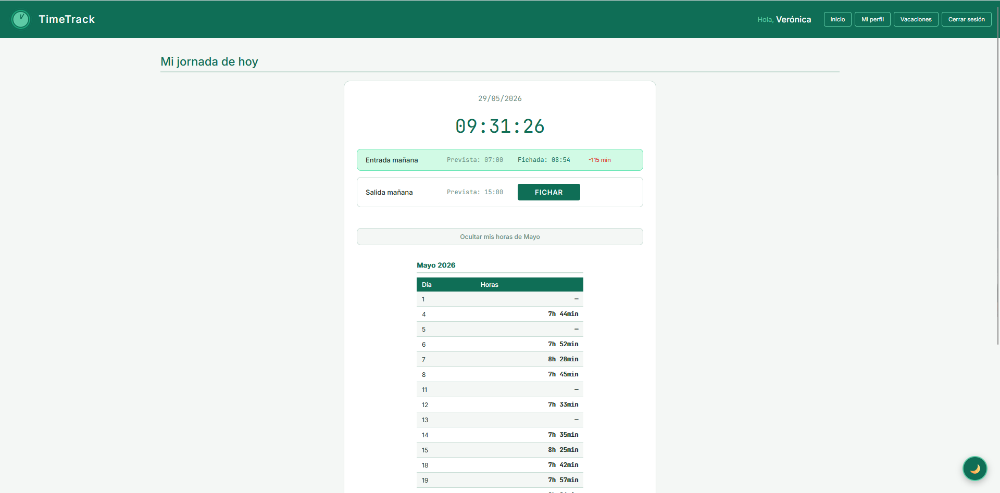

### Resumen mensual de horas

Debajo de los botones de fichaje el trabajador puede desplegar con un botón la tabla de horas del mes en curso. La tabla muestra las horas trabajadas cada día y el total acumulado del mes.

### Estados especiales

La aplicación detecta automáticamente situaciones en las que el trabajador no debe fichar y muestra un mensaje en lugar de los botones:

| Situación | Mensaje mostrado |
|---|---|
| Fin de semana | Hoy es fin de semana, ¡descansa! |
| Vacaciones | Hoy estás de vacaciones |
| Festivo | Hoy es festivo |
| Día libre | Hoy tienes el día libre |
| Cita médica | Hoy tienes cita médica |
| Asuntos propios | Hoy tienes un permiso por asuntos propios |
| Sin horario asignado | Contacta con el administrador |
| Jornada completada | ¡Jornada completada, hasta mañana! |

### Perfil

El trabajador puede consultar sus datos personales y laborales: nombre, email, DNI, teléfono, dirección, fecha de nacimiento, departamento, puesto, fecha de incorporación y días de vacaciones disponibles.

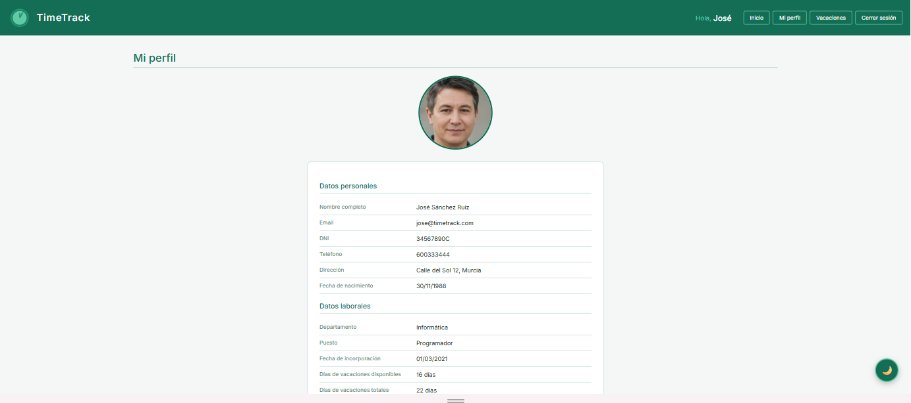

### Vacaciones

Muestra los días de vacaciones totales, gastados y disponibles, junto con el formulario para enviar nuevas solicitudes (vacaciones, asuntos propios, cita médica) con selector de fechas Flatpickr y el historial de solicitudes anteriores. También incluye el calendario de festivos nacionales del año en curso obtenido de la API Nager.Date.

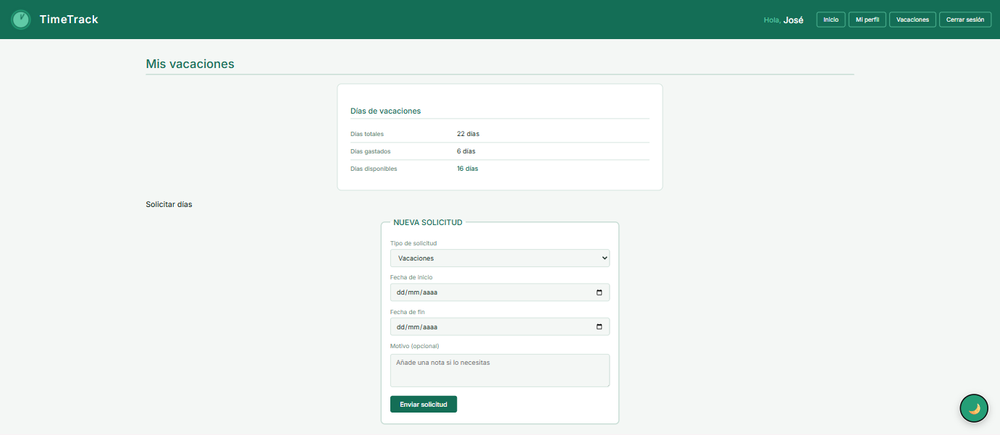

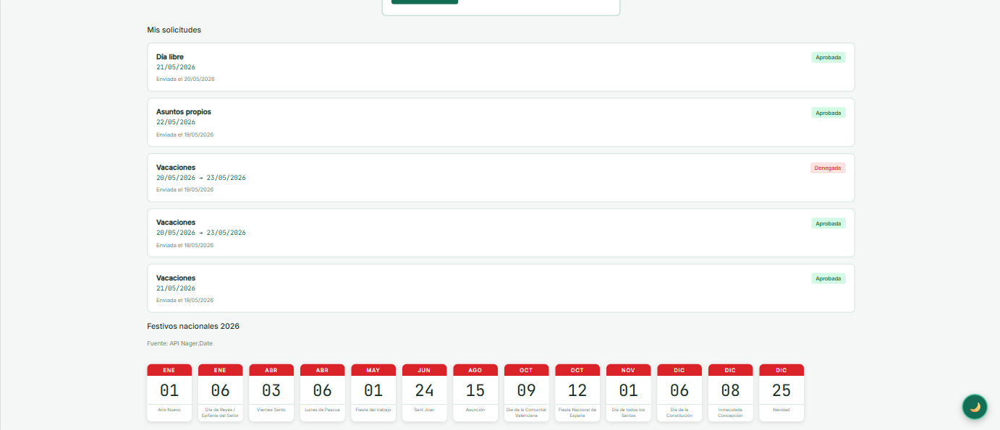

---

## Diseño responsive

La aplicación está construida con un enfoque **Mobile First**. Todos los paneles se adaptan a cualquier tamaño de pantalla. A continuación se muestran algunos ejemplos comparativos entre escritorio y dispositivos más pequeños.

**Dashboard del administrador:**

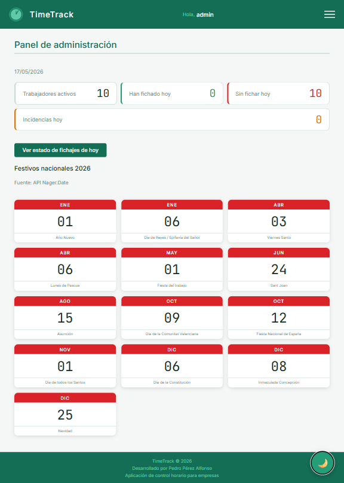

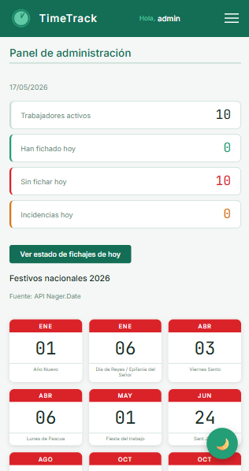

**Gestión de trabajadores:**

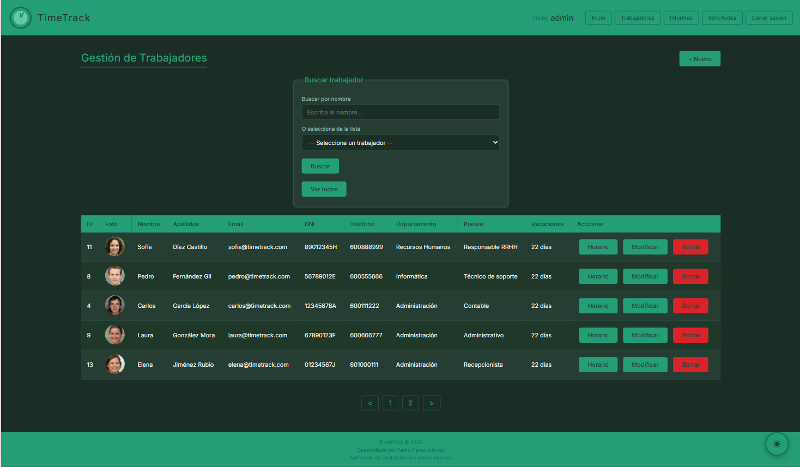

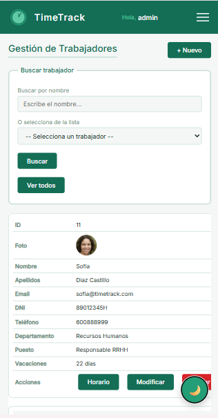

**Menú de navegación en móvil** — se accede mediante el botón hamburguesa en la cabecera:

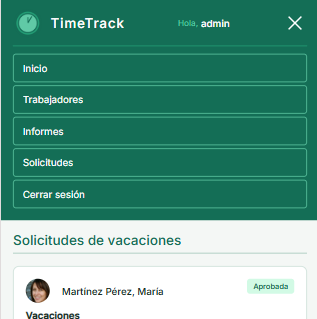

---

## Modo oscuro

La aplicación incluye un modo oscuro activable desde cualquier pantalla mediante el FAB (Floating Action Button) de la esquina inferior derecha. La preferencia se guarda en `localStorage` y persiste entre visitas.

**Dashboard:**

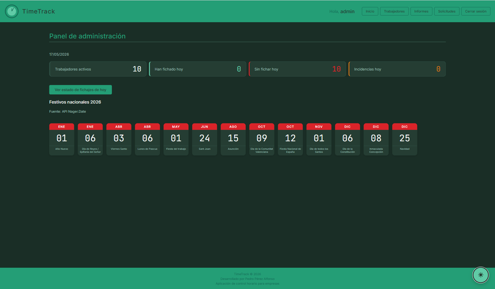

**Solicitudes de vacaciones:**

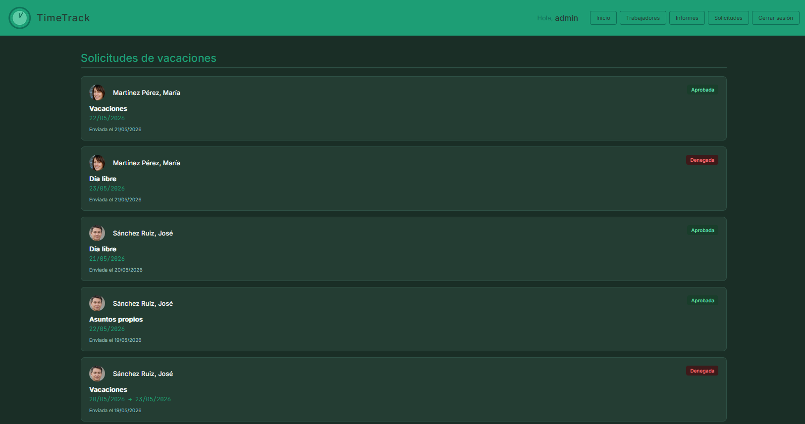

**Jornada del trabajador:**

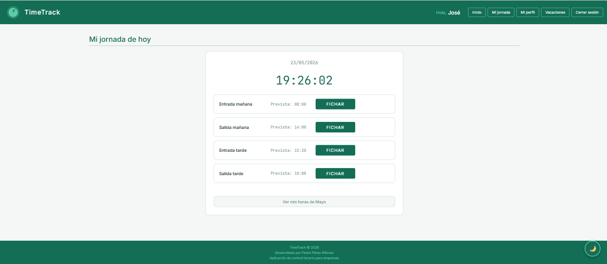

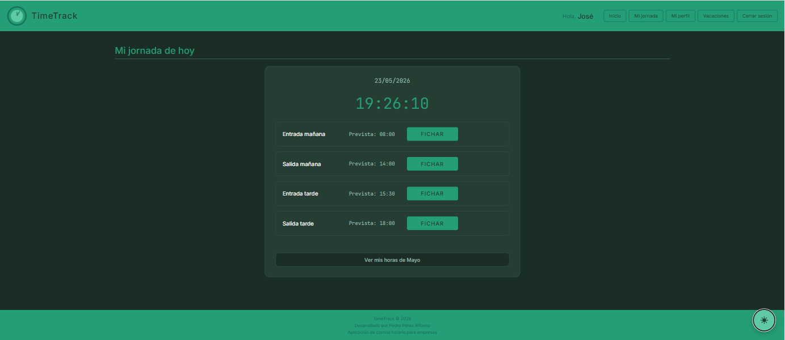
