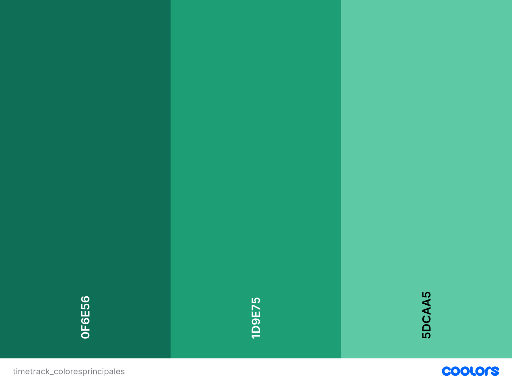

# Guía de Estilo Visual

## 1. Estructura

TimeTrack sigue una estructura de página clásica dividida en tres zonas:
**cabecera**, **contenido principal** y **pie de página**.

### Cabecera

La cabecera está definida en `includes/header.php` y se incluye en todas
las páginas de la aplicación tras iniciar sesión. Contiene tres elementos:

- **Logo y nombre:** imagen del logotipo junto al texto "TimeTrack".
- **Usuario conectado:** muestra un saludo con el nombre de la sesión activa.
- **Navegación:** menú de enlaces que cambia según el rol del usuario.

En móvil los tres elementos se apilan en columna. A partir de 768px
se reorganizan en una sola fila con el logo a la izquierda y el menú
a la derecha.

### Contenido principal

El elemento `<main>` ocupa todo el espacio disponible entre la cabecera
y el pie de página gracias a `flex: 1`. Tiene un padding que aumenta
progresivamente según el tamaño de pantalla: 16px en móvil, 24px en
tablet y 32px en escritorio. En pantallas grandes el contenido queda
centrado con un ancho máximo de 1400px.

### Pie de página

El pie de página está definido en `includes/footer.php` y se incluye
en todas las páginas. Muestra el nombre de la aplicación, el año actual
generado dinámicamente con PHP y el nombre del desarrollador. Siempre
queda pegado al fondo de la pantalla gracias a la estrategia
`flex-direction: column` y `min-height: 100vh` aplicada al `<body>`.

### Páginas sin cabecera

La página de inicio de sesión (`index.php`) no incluye la cabecera ni
el pie de la aplicación, ya que el usuario todavía no ha autenticado.
Tiene su propio layout centrado verticalmente en pantalla completa.

## 2. Color

### Colores principales

La aplicación usa una gama de verdes oscuros como color corporativo,
transmitiendo seriedad y confianza. Se definen tres niveles:

- **Color principal** (`#0F6E56`): es el color de marca. Se usa en la
  cabecera, el pie de página, los títulos de sección, los botones
  primarios y los bordes de elementos destacados.
- **Color acento** (`#1D9E75`): versión más clara del principal. Se usa
  en los estados hover de botones y enlaces de navegación.
- **Color acento suave** (`#5DCAA5`): versión muy clara. Se usa en
  fondos de badges, textos secundarios de la cabecera y detalles suaves.

### Colores de fondo y superficie

Se distinguen dos niveles de fondo para crear profundidad visual:

- **Color fondo** (`#F4F7F5`): fondo general de toda la aplicación.
  Es un blanco roto con un toque verde muy suave.
- **Color superficie** (`#FFFFFF`): fondo de tarjetas, formularios y
  tablas. El contraste entre superficie y fondo ayuda a separar
  visualmente los bloques de contenido.

### Colores de texto

- **Color texto** (`#1A2E26`): texto principal. Es un negro verdoso
  oscuro, más suave que el negro puro.
- **Color texto apagado** (`#6A8F82`): texto secundario, etiquetas de
  formulario y placeholders.

### Color de borde

- **Color borde** (`#C8DDD5`): usado en los bordes de inputs, tablas
  y tarjetas. Mantiene la coherencia cromática con el resto de la paleta.

### Colores de estado

Para comunicar el resultado de las acciones del usuario se usan cuatro
colores de estado estándar, independientes de la paleta corporativa:

- **Información** (`#2563EB`): mensajes informativos y el botón de
  acceso al horario del trabajador.
- **Advertencia** (`#D97706`): alertas y avisos, como solicitudes
  pendientes de aprobar en el dashboard.
- **Error** (`#DC2626`): errores de validación, mensajes negativos
  y el botón de borrar trabajadores.
- **Neutro** (`#6B7280`): estados desactivados o sin relevancia.