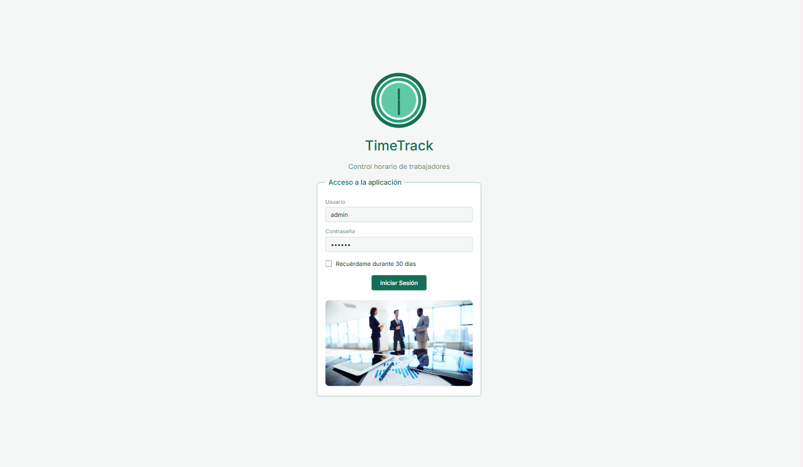

# TimeTrack — Documentación del Proyecto

**Autor:** Pedro Pérez Alfonso  
**Ciclo:** CFGS Desarrollo de Aplicaciones Web (2º DAW)  
**Centro:** IES Macià Abela  
**Curso:** 2025-2026  
**Tutor:** Javier Mas Díaz  

---

## ¿Qué es TimeTrack?

TimeTrack es una aplicación web para el control horario de los trabajadores de una empresa. Los trabajadores fichan su entrada y salida desde cualquier dispositivo, y el administrador gestiona horarios, vacaciones, incidencias y genera informes en PDF.

---

## Índice de la documentación

1. [Funcionalidades](funcionalidades.md) — Pantallas, flujos y casos de uso
2. [Arquitectura](arquitectura.md) — Estructura del proyecto, base de datos y roles
3. [Tecnologías](tecnologias.md) — Detalle técnico de cada tecnología utilizada
4. [Despliegue](despliegue.md) — Entornos, control de versiones y flujo de trabajo
5. [API externa](api.md) — Integración con la API Nager.Date

---

## Repositorio

[github.com/PedroPerezDev/timeTrack](https://github.com/PedroPerezDev/timeTrack)

## Aplicación en producción

[www.mytimetrack.es](https://www.mytimetrack.es)