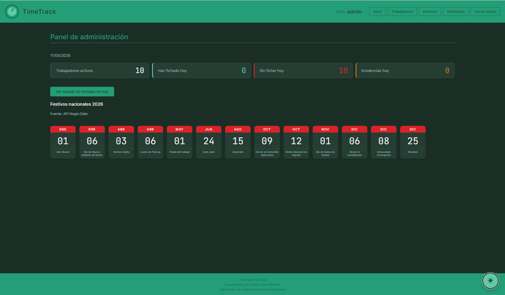
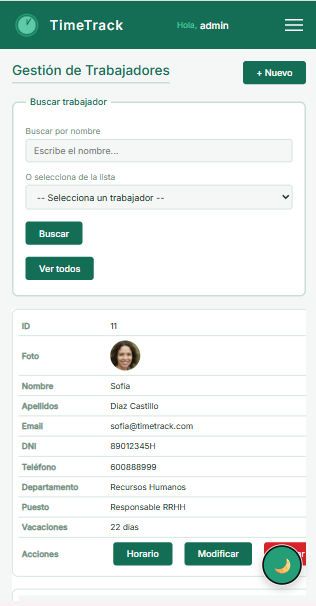

# Tecnologías

[← Volver al índice](index.md)

---

## PHP

PHP gestiona toda la lógica del servidor: autenticación, sesiones, consultas a la base de datos y generación de HTML dinámico.

**Patrones utilizados:**
- Sesiones con `session_start()` para mantener al usuario autenticado
- Cookies seguras con `httponly` y `samesite` para la funcionalidad "Recuérdame"
- Consultas con MySQLi orientado a procedimientos
- Inclusión de plantillas con `include` para header, footer y funciones

---

## MySQL

La base de datos almacena todos los datos de la aplicación: usuarios, horarios, fichajes, incidencias y festivos. Se conecta desde PHP mediante la extensión MySQLi.

La conexión y desconexión están centralizadas en `config.php` mediante las funciones `conectar()` y `desconectar()`. El archivo `config.php` está excluido del repositorio mediante `.gitignore` para proteger las credenciales. En su lugar se incluye `config.ejemplo.php` con los campos vacíos como plantilla.

---

## JavaScript y jQuery

Todo el código JavaScript del cliente está en `js/main.js`. Se utiliza **jQuery 3.2.1** cargado desde CDN de Google.

### Objeto Date — Reloj en tiempo real

El panel del trabajador muestra un reloj que se actualiza cada segundo usando el objeto `Date` de JavaScript y `setInterval`:

```javascript
function actualizarReloj() {
    var ahora   = new Date();
    var horas   = String(ahora.getHours()).padStart(2, '0');
    var minutos = String(ahora.getMinutes()).padStart(2, '0');
    var segundos = String(ahora.getSeconds()).padStart(2, '0');
    document.getElementById('reloj').textContent = horas + ':' + minutos + ':' + segundos;
}

setInterval(actualizarReloj, 1000);
```

### Efectos Fade — Slideshow

El slideshow de la pantalla de login usa `fadeOut` y `fadeIn` de jQuery para transicionar entre imágenes cada 5 segundos:

```javascript
$(slides[actual]).fadeOut("slow", function() {
    $(slides[siguiente]).fadeIn("slow");
});
```

### Efectos Slide — Formularios y tablas desplegables

Los formularios y tablas que se muestran u ocultan al pulsar un botón usan `slideDown` y `slideUp`:

```javascript
$("#btn-mostrar-especial").click(function() {
    if ($("#form-especial").is(":visible")) {
        $("#form-especial").slideUp("slow");
    } else {
        $("#form-especial").slideDown("slow");
    }
});
```

Elementos con efecto slide en la aplicación:

| Botón | Elemento |
|---|---|
| Ver estado de fichajes | Tabla de fichajes del día (admin) |
| + Añadir día especial | Formulario de día especial |
| Ver días especiales | Tabla de días especiales |
| Ver incidencias | Tabla de incidencias del informe |
| + Nuevo trabajador | Formulario de alta |
| Modificar | Formulario de modificación |

### Modo oscuro

El modo oscuro añade o quita la clase `modo-oscuro` del `body` y guarda la preferencia en `localStorage`:

```javascript
function toggleModo() {
    $("body").toggleClass("modo-oscuro");
    if ($("body").hasClass("modo-oscuro")) {
        localStorage.setItem("timetrack_modo", "oscuro");
    } else {
        localStorage.setItem("timetrack_modo", "claro");
    }
}
```

La preferencia persiste entre sesiones. Al cargar cualquier página, el script lee `localStorage` y aplica la clase antes de que el navegador pinte la interfaz, evitando el parpadeo.

El botón de modo oscuro es un FAB (Floating Action Button) que aparece en la esquina inferior derecha en todas las pantallas:



### Validación con expresiones regulares

El formulario de alta de trabajadores valida los campos en el cliente antes de enviar:

| Campo | Expresión regular |
|---|---|
| Nombre / Apellidos | `/^[a-záéíóúüñA-ZÁÉÍÓÚÜÑ\s]+$/` |
| Email | `/^[a-zA-Z0-9._%+-]+@[a-zA-Z0-9.-]+\.[a-zA-Z]{2,}$/` |
| DNI | `/^[0-9]{8}[A-Za-z]$/` |
| Teléfono | `/^[679][0-9]{8}$/` |
| Contraseña | `/^.{8,}$/` |

---

## AJAX

La comunicación asíncrona con el servidor se realiza mediante `$.ajax()` de jQuery. El caso principal es el fichaje del trabajador, que se registra sin recargar la página para no interrumpir el reloj:

```javascript
$.ajax({
    url:    "/ajax/fichar.php",
    method: "POST",
    data:   { tipo: tipo, hora: hora },
    success: function(respuesta) {
        var datos = JSON.parse(respuesta);
        if (datos.ok) {
            $("#respuesta-fichaje").fadeIn("slow");
            setTimeout(function() { location.reload(); }, 2000);
        }
    }
});
```

El servidor devuelve siempre un objeto JSON con el resultado de la operación.

---

## HTML5

La estructura de todas las páginas usa etiquetas semánticas de HTML5: `<header>`, `<main>`, `<footer>`, `<nav>`, `<fieldset>`, `<legend>`. Los formularios usan los tipos de input correctos: `email`, `date`, `time`, `file`, `password`.

---

## CSS3 — Mobile First

El diseño sigue la estrategia **Mobile First**: los estilos base están escritos para móvil, y se amplían mediante `@media (min-width: ...)` para tablet y escritorio.

| Breakpoint | Pantalla |
|---|---|
| Base (sin media query) | Móvil |
| `min-width: 768px` | Tablet |
| `min-width: 1024px` | Escritorio |

Las tablas se adaptan a móvil convirtiéndose en tarjetas apiladas. Cada `<td>` tiene un atributo `data-label` que el CSS usa con el pseudo-elemento `::before` para mostrar la etiqueta de la columna:

```css
@media (max-width: 768px) {
    .tabla-apilable thead { display: none; }
    .tabla-apilable tr    { display: block; }
    .tabla-apilable td    { display: flex; }
    .tabla-apilable td::before {
        content: attr(data-label);
        font-weight: 600;
        min-width: 110px;
    }
}
```

La misma tabla de trabajadores vista en móvil apila cada registro en tarjeta vertical:



El diseño usa variables CSS personalizadas para los colores, tipografía y radios de borde, lo que facilita el modo oscuro: al añadir la clase `modo-oscuro` al `body`, las variables se sobreescriben y toda la interfaz cambia de tema sin duplicar reglas.

---

## FPDF

FPDF es una librería PHP de código abierto incluida en `libs/fpdf/` que permite generar archivos PDF sin necesidad de extensiones adicionales en el servidor.

Los informes de fichajes se generan en `admin/pdf.php`. El PDF incluye:
- Cabecera con el logo y nombre de la aplicación
- Tabla de fichajes del período seleccionado
- Resumen con horas previstas y balance final
- Pie de página con la fecha de generación

---

## Git y GitHub

El repositorio está en [github.com/PedroPerezDev/timeTrack](https://github.com/PedroPerezDev/timeTrack).

Se trabaja con dos ramas:

- `main` — versión estable en producción
- `desarrollo` — trabajo activo de nuevas funcionalidades

Etiquetas creadas:

- `v1.0` — primera versión funcional con login y fichaje
- `v2.0` — versión con responsive completo, modo oscuro y refactoring
